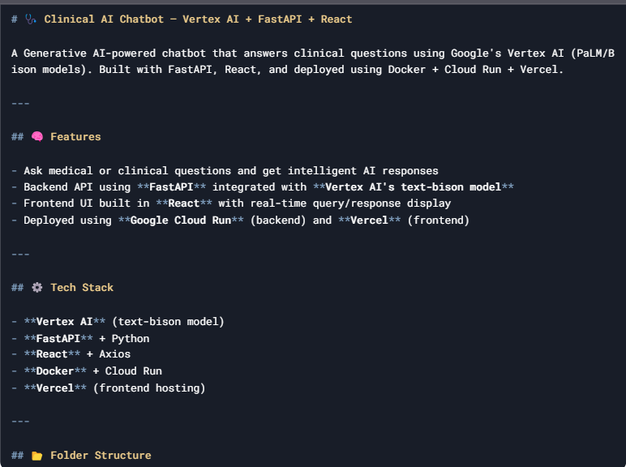
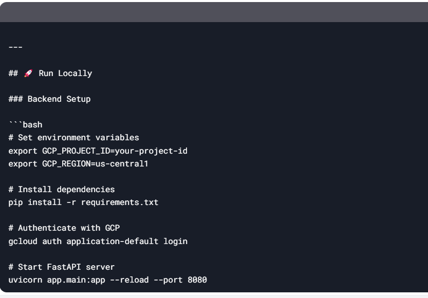
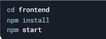
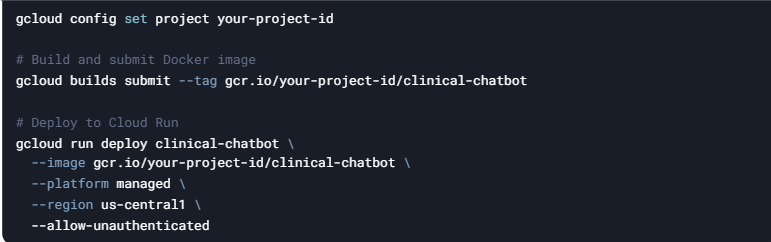

clinical-chatbot/
├── app/
│ ├── main.py # FastAPI app
│ ├── vertex_ai_service.py # Vertex AI integration
│ └── models/ # (optional)
│ └── schema.py
├── requirements.txt
├── Dockerfile
├── frontend/ # React UI
│ └── src/
│ └── components/
│ └── ChatInterface.jsx
└── README.md

Note: Ensure Vertex AI API is enabled in your Google Cloud project

Frontend Setup

Note: Backend must be running at localhost:8080

☁️ Deployment
Backend (Cloud Run)

Frontend (Vercel)
Push frontend code to a GitHub repository

Create new project in Vercel

Import GitHub repository

Set environment variable REACT_APP_API_URL to your Cloud Run endpoint

Deploy

❓ Example Queries
What are the symptoms of diabetes?

How is hypertension treated in elderly patients?

What is the recommended dosage of metformin?

💬 License
MIT License - see LICENSE for details

Important: Replace all environment variables (your-project-id) with your actual GCP credentials before deployment.